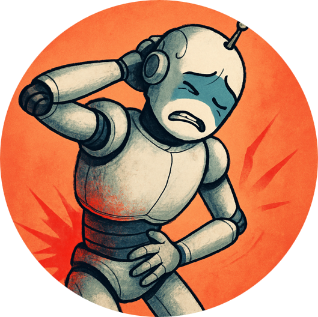

<!-- top-of-readme logo -->
<p align="center">
  
</p>

# AchyBot

**AchyBot** is an R/Shiny chatbot that simulates patients with musculoskeletal conditions. It’s an interactive learning tool for clinical reasoning, patient communication, and diagnostic practice.

<!-- badges: start -->
[](LICENSE)
[](https://github.com/steenharsted/AchyBot/commits/master)
<!-- badges: end -->

<br>

## Try AchyBot

**Danish Version** 
🔗 https://shinylab.sdu.dk/AchyBot/  

**English Version** 
🔗 https://shinylab.sdu.dk/AchyBot_eng/


<br>
  
## Key Features

- Supports multiple musculoskeletal conditions 
- Interactive Q&A for enhanced clinical reasoning practice
- Ideal for health‑care training of students with a focus on musculoskeletal health care. 

<br>

## 💾 Installation

```bash
git clone https://github.com/steenharsted/AchyBot.git
cd AchyBot
Rscript -e "shiny::runApp()"
```
